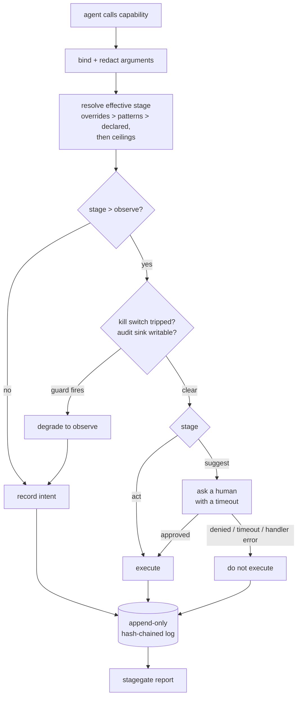

# stagegate

A Python library for staged rollout of agent capabilities: each capability is registered at a stage — observe, suggest, or act — and the stage governs what actually happens when the agent invokes it.

## The problem

An agent that can file a ticket can file ten thousand tickets. The usual rollout is a boolean: the capability is either wired up to the real system or it is commented out, so the only way to find out what an agent will do in production is to let it do it. When something does go wrong, the reconstruction is a grep through application logs that were never designed to answer "what did it try to do, who approved it, and what got through."

StageGate makes that rollout a ladder rather than a switch. A capability starts in shadow mode, where its full intended effect is recorded and nothing executes; it graduates to human approval; and only then does it act — one audit record per call at every stage, a kill switch that degrades rather than crashes, and a dry-run report to hand to whoever signs the deployment off.

## Quickstart

Python 3.12+. No runtime dependencies — standard library only. The dev extra pulls in `pytest`, `ruff` and `mypy`.

```bash
uv venv && source .venv/bin/activate    # or: python3.12 -m venv .venv && source .venv/bin/activate
uv pip install -e ".[dev]"              # or: pip install -e ".[dev]"
python -m pytest                        # 302 tests, no network, no credentials
python examples/triage_agent.py
```

`ruff check .` and `mypy src/stagegate` both pass clean; their configuration is in `pyproject.toml`.

```python
from stagegate import StageGate, Stage, RiskTier, JsonlAuditLog, agent_run

gate = StageGate(audit=JsonlAuditLog("audit.jsonl"))

@gate.capability(
    "tickets.transition",
    stage=Stage.OBSERVE,                       # shadow mode: records, does not run
    risk=RiskTier.HIGH,
    describe="Move {ticket_id} to {status}",   # what a human reads when asked to approve
)
def transition_ticket(ticket_id: str, status: str) -> dict:
    """Change a ticket's state in the real ticketing system."""
    return real_client.transition(ticket_id, status)

with agent_run(actor="triage-bot@example.com"):
    result = transition_ticket("T-1001", "in_progress")

result.executed          # False — OBSERVE recorded the intent and ran nothing
result.event.effect      # 'Move T-1001 to in_progress'
result.value_or(None)    # None
```

Run it for two weeks, then build the report that gets the promotion approved:

```bash
stagegate report audit.jsonl > shadow-report.md
stagegate verify audit.jsonl      # exit 1 if the hash chain is broken
```

Promotion is a configuration change, not a code change:

```toml
# policy.toml — the file a reviewer approves
[stagegate]
max_stage_by_risk = { critical = "suggest" }   # ceilings only ever lower a stage

[stagegate.overrides]
"tickets.transition" = "suggest"               # promoted 2026-07-14, see shadow-report.md

[stagegate.patterns]
"tickets.*" = "observe"                        # anything not named above stays in shadow
```

```python
from stagegate import StagePolicy, QueueApprovalHandler

approvals = QueueApprovalHandler()             # your web handler calls .resolve(...)
gate = StageGate(
    audit=JsonlAuditLog("audit.jsonl"),
    policy=StagePolicy.from_file("policy.toml"),
    approval=approvals,
)
```

Nothing at the call site changes. `transition_ticket("T-1001", "in_progress")` now parks for approval instead of recording, and the audit log says which.

## How it works

One decorator registers the capability; one call site routes it. Every path through the gate produces exactly one audit record.



The pieces are separable, and each is a protocol you can replace:

| Component | Responsibility |
| --- | --- |
| `StageGate` | Registry and router. The only thing a capability author touches. |
| `StagePolicy` | Where the effective stage comes from. Loaded from TOML/JSON, not code. |
| `KillSwitch` | Env var and file sentinel, checked before anything executes. |
| `ApprovalHandler` | Protocol. `CLIApprovalHandler` for a terminal, `QueueApprovalHandler` for a web approver on another thread. |
| `Redactor` | Any callable sanitising arguments. `RedactionPolicy` is the batteries-included one. |
| `AuditSink` | Protocol. `JsonlAuditLog` chains records; implement it to ship to a SIEM. |
| `DryRunReport` | Turns a shadow-mode log into the document a change board reads. |

Audit records are one JSON object per line with a versioned schema (`stagegate.audit/1`), carrying timestamp, capability, declared and effective stage, risk tier, redacted arguments, intended effect, decision, actor, outcome, duration, correlation id, parent event id, and the hash chain fields.

For a tool-calling agent, `gate.invoke("tickets.transition", ticket_id="T-1001", status="done")` dispatches by name through the same gate, policy, kill switch and audit trail as a direct call — so the model's tool schema and the governed surface cannot drift apart. An unknown name raises rather than no-opping, because a model naming a tool that does not exist is something the agent host needs to feed back to the model.

## Design decisions

- **A gated call returns a `CapabilityResult`, never a bare value.** This is the library's one piece of deliberate ergonomic friction. In shadow mode there is no return value, and a design that quietly hands back `None` invites callers to treat "nothing happened" as "succeeded and returned nothing" — which is exactly the bug that makes a shadow deployment useless. `result.executed`, `result.unwrap()` and `result.value_or(default)` force you to say which you meant.

- **The kill switch can be tripped from the environment but not cleared from it.** `STAGEGATE_KILL=1` trips; `STAGEGATE_KILL=0` *abstains* rather than clearing a file sentinel someone else put there. Anyone with a shell should be able to stop an agent at 3am; nobody with a shell should be able to silently resume one that an incident commander stopped. Unparseable values trip too — a switch that ignores `STAGEGATE_KILL=yes-please` is not a switch. Full precedence is documented in `killswitch.py`.

- **A tripped switch degrades to `OBSERVE` instead of raising.** Raising into the agent turns a controlled stop into a crash loop and destroys the record of what the agent wanted to do while it was stopped. Degrading keeps the agent running, keeps recording intent, and leaves you with a complete picture of the outage from the agent's side.

- **The audit log is hash-chained, which makes tampering evident rather than impossible.** Records are `O_APPEND` and the sink exposes no update or delete, but anyone with write access can still edit the file. Each record therefore chains to its predecessor, so `verify_chain` reports exactly which record broke and where. That makes tampering *evident*, not impossible. Making it impossible requires anchoring the head hash somewhere the same operator does not control, which is a deployment decision — so the report prints the head hash for you to anchor.

- **Redaction runs before anything reaches a sink or a human, including the effect description.** `describe` receives the *redacted* arguments, never the raw ones, and its output is scrubbed again on the way out. The invariant is worth more than the convenience: no raw argument value leaves the process through StageGate, ever. If an approver genuinely needs a value the policy hides, narrow the policy for that capability — a change someone reviews — rather than punching a hole in the invariant.

- **Every ambiguity fails closed, and the failure is a recorded event rather than an exception.** No approval handler configured, handler raises, approval times out, redaction policy throws, audit sink fails preflight — each produces a refusal *and* an audit record explaining it. The one thing that does raise is an audit record reaching no sink at all, because at that point the process has taken an action it cannot account for.

## Limitations

- **Synchronous callables only.** `async def` capabilities are rejected at registration with a clear error rather than silently wrapped into something that returns a coroutine nobody awaits. `QueueApprovalHandler` is "asynchronous" in the sense that the approver is on another thread, not in the asyncio sense.
- **The hash chain assumes one writer per file.** Two processes appending to the same log will both chain onto the same `prev_hash` and `verify_chain` will flag it. Give each process its own log, or implement `AuditSink` against something with a real serialisation point.
- **Shadow mode proves intent, not success.** An `OBSERVE` record shows what the agent wanted to do. It does not show that the call would have been accepted, authorised, or non-erroring against the real system. The report says so on its own front page, and `execution evidence` is permanently `unknown` for shadow-only capabilities. Do not read a clean dry-run report as a green light.
- **`SUGGEST` blocks the calling thread.** That is the correct semantics — the agent must not proceed as though the action happened — but it means a long approval timeout ties up a worker. Size your pool accordingly, or drive the gate from a task queue.
- **No built-in rate limiting, quota, or spend control.** The gate governs *whether* a capability may act, not how often. Compose it with your own limiter.
- **A custom kill-switch probe gets no deadline.** The env var and file sentinel are local and fast, but an `extra_probes` entry that calls a feature-flag service is called synchronously with no timeout imposed on it — a hanging probe hangs the call. Give the probe its own timeout and a `cache_ttl`.
- **Redaction is best-effort pattern matching.** The key list and value patterns catch the common shapes; they will not catch a secret passed as an unusually-named string that matches no pattern. Treat it as defence in depth, not a guarantee, and narrow the policy per capability where it matters.
- **No persistence for pending approvals.** `QueueApprovalHandler` keeps them in memory; a process restart loses them, and the blocked calls die with it. Durable approvals need a sink-backed handler, which is left to the deployment.

## License

MIT. Copyright (c) 2026 Kathleen Bartin.
